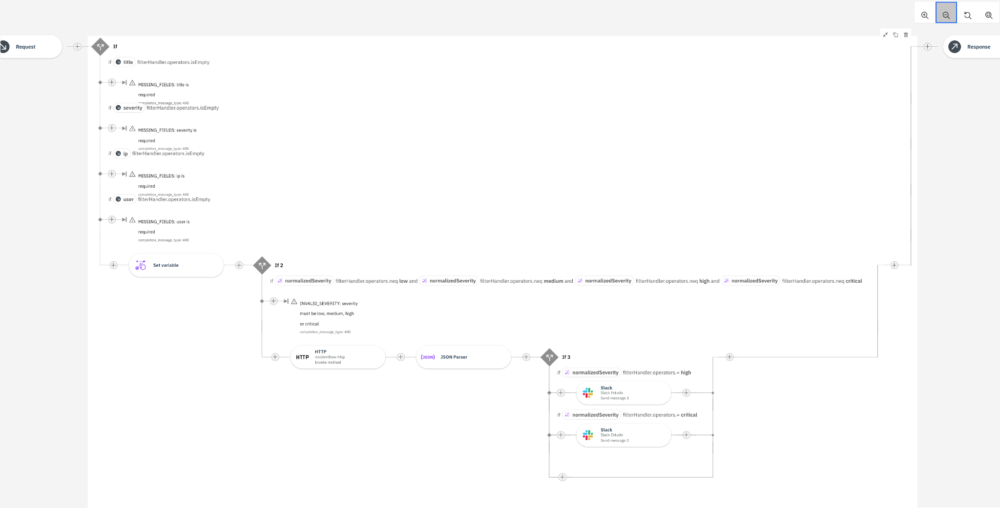

# IncidentFlow

IncidentFlow é uma API de gerenciamento e automação de incidentes desenvolvida para demonstrar um fluxo de integração ponta a ponta entre **IBM App Connect, Node.js, PostgreSQL e Slack**.

O projeto recebe incidentes, valida e normaliza os dados, persiste as informações no banco de dados e envia alertas automáticos ao Slack de acordo com a severidade.

## Arquitetura



```text
Cliente
   ↓
IBM App Connect
   ↓
Validação e normalização
   ↓
HTTP Connector
   ↓
Private Network / Secure Agent
   ↓
Node.js / Express
   ↓
PostgreSQL
   ↓
Incident ID gerado
   ↓
IBM App Connect
   ↓
Classificação por severidade
   │
   ├── LOW      → sem alerta
   ├── MEDIUM   → sem alerta
   ├── HIGH     → ⚠️ Slack
   └── CRITICAL → 🚨 Slack
   ↓
Resposta HTTP
```

## Fluxo de severidade

| Severity | PostgreSQL | Slack |
|---|---|---|
| `low` | Salva | Sem alerta |
| `medium` | Salva | Sem alerta |
| `high` | Salva | ⚠️ Alerta HIGH |
| `critical` | Salva | 🚨 Alerta CRITICAL |

Todas as severidades são normalizadas para letras minúsculas antes de serem persistidas.

Exemplo:

```text
HIGH → high
Critical → critical
MEDIUM → medium
```

## API

### Criar incidente

```http
POST /incidents
```

Exemplo de request:

```json
{
  "title": "Suspicious login detected",
  "severity": "HIGH",
  "ip": "192.168.1.50",
  "user": "employee01"
}
```

Exemplo de response:

```json
{
  "incidentId": "INC-2026-0013",
  "status": "created",
  "severity": "high"
}
```

Status:

```text
201 Created
```

---

### Listar incidentes

```http
GET /incidents
```

Exemplo de response:

```json
[
  {
    "id": 1,
    "incident_code": "INC-2026-0001",
    "title": "Suspicious login detected",
    "severity": "high",
    "ip": "192.168.1.50",
    "username": "employee01",
    "status": "OPEN"
  }
]
```

Status:

```text
200 OK
```

---

### Buscar incidente por ID

```http
GET /incidents/:id
```

Exemplo:

```http
GET /incidents/1
```

Se o incidente existir:

```text
200 OK
```

Se não existir:

```json
{
  "error": "INCIDENT_NOT_FOUND"
}
```

Status:

```text
404 Not Found
```

## Validações

O backend possui validações próprias e não depende apenas do IBM App Connect.

### Campos obrigatórios

São obrigatórios:

```text
title
severity
ip
user
```

Caso algum esteja ausente:

```json
{
  "error": "MISSING_FIELDS"
}
```

### Severity

Valores permitidos:

```text
low
medium
high
critical
```

Valores em maiúsculas ou formatos diferentes são normalizados antes da validação.

Exemplo:

```text
HIGH → high
```

Uma severity inválida retorna:

```json
{
  "error": "INVALID_SEVERITY",
  "message": "Severity must be low, medium, high or critical"
}
```

### IP

O backend utiliza o módulo nativo `net` do Node.js para validar endereços IPv4 e IPv6.

Exemplos válidos:

```text
192.168.1.50
10.0.0.99
127.0.0.1
::1
```

Um IP inválido retorna:

```json
{
  "error": "INVALID_IP",
  "message": "IP must be a valid IPv4 or IPv6 address"
}
```

## Tratamento de erros

As operações com PostgreSQL são protegidas com `try/catch`.

Se o banco estiver indisponível durante a criação de um incidente:

```json
{
  "error": "INTERNAL_SERVER_ERROR",
  "message": "Failed to create incident"
}
```

Para falhas ao listar incidentes:

```json
{
  "error": "INTERNAL_SERVER_ERROR",
  "message": "Failed to fetch incidents"
}
```

Para falhas ao buscar um incidente:

```json
{
  "error": "INTERNAL_SERVER_ERROR",
  "message": "Failed to fetch incident"
}
```

Detalhes técnicos dos erros são registrados no servidor e não enviados ao cliente.

## PostgreSQL

Cada incidente recebe um identificador único gerado pelo backend a partir de uma sequence do PostgreSQL.

Formato:

```text
INC-2026-0001
INC-2026-0002
INC-2026-0003
...
```

O banco mantém informações como:

```text
incident_code
title
severity
ip
username
status
created_at
```

## IBM App Connect

O IBM App Connect funciona como camada de integração e orquestração.

O fluxo realiza:

1. Recebimento do incidente
2. Validação dos campos obrigatórios
3. Normalização da severity
4. Validação da severity
5. Chamada HTTP para o backend
6. Parsing da resposta JSON
7. Recuperação do `incidentId`
8. Classificação por severidade
9. Disparo condicional de alertas no Slack
10. Retorno da resposta ao cliente

## Private Network / Secure Agent

Como a API Node.js é executada localmente em:

```text
http://localhost:3000
```

o IBM App Connect Cloud utiliza uma **Private Network** com **IBM Secure Agent** para acessar o serviço local sem expor diretamente a API à internet.

Fluxo:

```text
IBM App Connect Cloud
        ↓
Private Network
        ↓
Secure Agent
        ↓
localhost:3000
        ↓
Node.js
```

O arquivo real de configuração do agente é privado e não é versionado:

```text
ibm/switchclient.json
```

Também são ignorados:

```text
secureagent-logs/
```

## Slack

Os alertas são enviados para:

```text
#incident-alerts
```

### HIGH

Exemplo:

```text
⚠️ HIGH SEVERITY INCIDENT
Incident ID: INC-2026-0005
Title: Suspicious login detected
Severity: high
IP: 192.168.1.50
User: employee05
```

### CRITICAL

Exemplo:

```text
🚨 CRITICAL INCIDENT 🚨
Incident ID: INC-2026-0007
Title: Database exfiltration detected
Severity: critical
IP: 10.0.0.99
User: employee06
```

Incidentes `low` e `medium` continuam sendo persistidos no PostgreSQL, mas não geram alertas no Slack.

## Testes realizados

O projeto foi validado em diferentes cenários:

- criação de incidentes
- listagem de incidentes
- busca individual
- campos obrigatórios ausentes
- severity inválida
- normalização de severity
- IPv4 válido
- IPv6 válido
- IP inválido
- incidente inexistente
- PostgreSQL indisponível
- recuperação após reiniciar o PostgreSQL
- alerta HIGH no Slack
- alerta CRITICAL no Slack
- LOW sem alerta
- MEDIUM sem alerta
- fluxo completo IBM → Node.js → PostgreSQL → Slack

## Tecnologias

- Node.js
- Express
- PostgreSQL
- IBM App Connect
- IBM Secure Agent
- IBM Private Network
- Slack
- REST API
- HTTP / JSON
- Git
- GitHub

## Executando localmente

Instale as dependências:

```bash
npm install
```

Certifique-se de que o PostgreSQL esteja disponível.

Inicie a API:

```bash
node index.js
```

A aplicação ficará disponível em:

```text
http://localhost:3000
```

## Segurança

Arquivos com credenciais, certificados ou configurações privadas não devem ser enviados ao repositório.

O projeto utiliza `.gitignore` para manter fora do Git arquivos como:

```text
.env
ibm/switchclient.json
secureagent-logs/
node_modules/
```

## Status

✅ Projeto funcional

O IncidentFlow atualmente possui:

```text
API REST
Validação de entrada
Normalização de dados
Persistência PostgreSQL
IDs automáticos
Tratamento de erros
Private Network
Integração IBM App Connect
Alertas condicionais no Slack
Testes End-to-End
```

## Objetivo do projeto

O IncidentFlow foi desenvolvido como projeto prático de integração e automação, aplicando conceitos de APIs REST, backend, banco de dados, integração cloud, redes privadas, tratamento de erros e automação de resposta a incidentes.